# OpsOne

一体化运维管理平台。把主机资产、远程执行、堡垒机审计、容器、监控告警、组织权限收敛到一个工作台，面向中小规模自建环境。

后端 Go + Gin + GORM，前端 Vue 3 + TypeScript + Vite + Element Plus，默认 SQLite 落地、零外部依赖即可跑起来。

## 界面预览

一页看清平台管着什么：纳管主机与在线状态、环境分布、最近的批量执行。

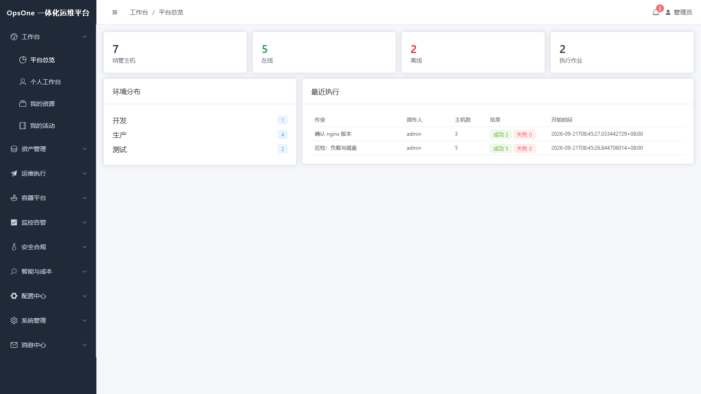

**会话回放 + 命令拦截**：Web 终端全程录像（asciinema v2），网页端按 1/2/4/8 倍速回放、按命令定位时间点。红色那行是平台在输入流上还原出命令后**直接拦下没有下发**，并写明命中了哪条规则。

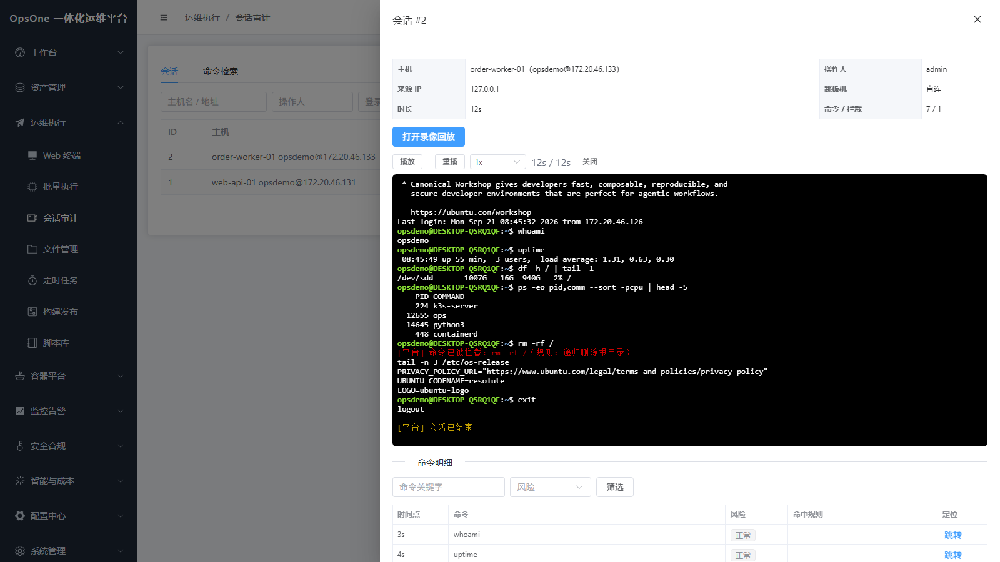

**跨所有会话检索命令**：回答「谁在哪台机器上敲过 `rm -rf`」——按命令关键字、风险、操作人、登录账号、主机、时间范围组合查，点一行跳到那次会话的录像并定位到该命令。命中规则的描述是记录当时的快照，规则后来改名或删掉也不影响历史。

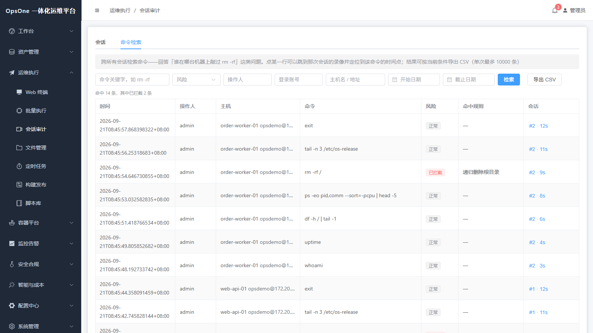

**主机资产**：环境 / 状态 / 标签过滤，一键 SSH 探测回填系统信息，跳板机链路直接标在列表上。

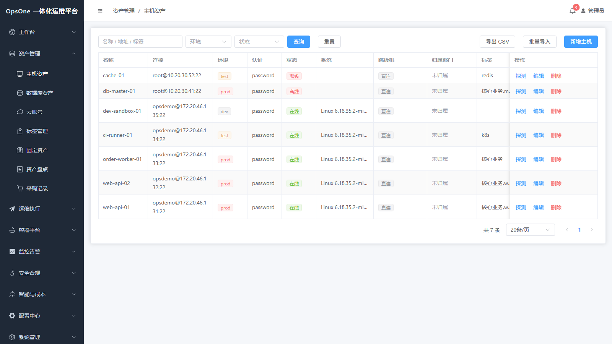

**主机指标**：走已有的 SSH 通道采集 CPU / 内存 / 磁盘 / 负载，**不装 agent、不依赖 Prometheus**；采集失败的主机如实留痕，不会假装有数据。

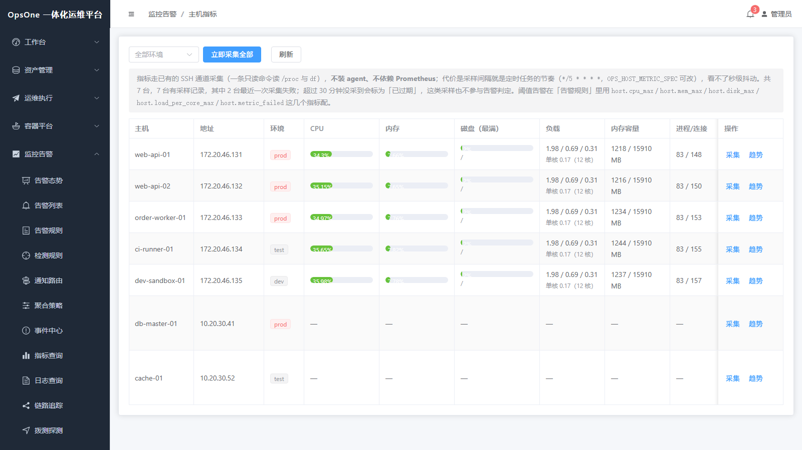

**告警处理**：概览卡片 + 级别/状态/关键字筛选、确认与恢复、同指纹去重只累加次数；平台自身的巡检（拨测、证书、主机指标等）与外部推送的告警进同一个池子。

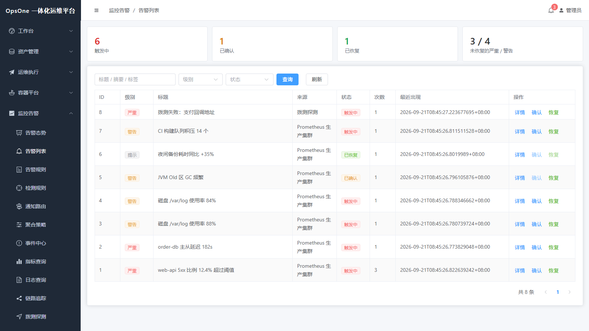

**告警态势**：趋势、级别分布、来源分布与 Top 标签，用来回答「这几天在刷什么」。

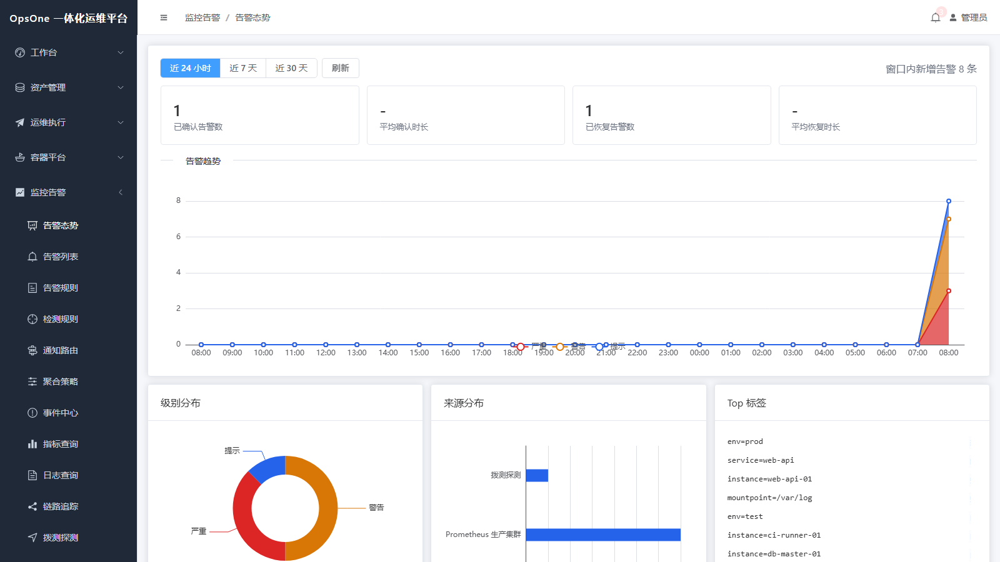

**容器平台**：粘贴 kubeconfig 就能纳管，手写 REST 调 Kubernetes API（不引入 client-go）；工作负载的副本就绪情况、Pod 异常原因、集群事件都在一页里。

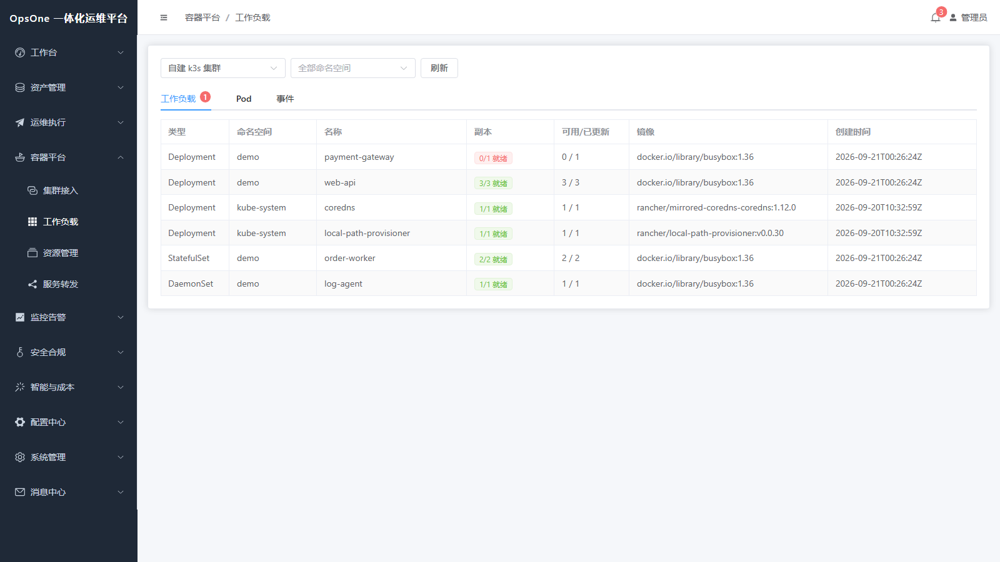

**业务拓扑**：节点绑定平台里已有的主机 / 数据库 / 拨测 / 证书，颜色由这些资源的当前状态实时换算，并给出判定理由；拓扑自己不采集数据、不产生告警。

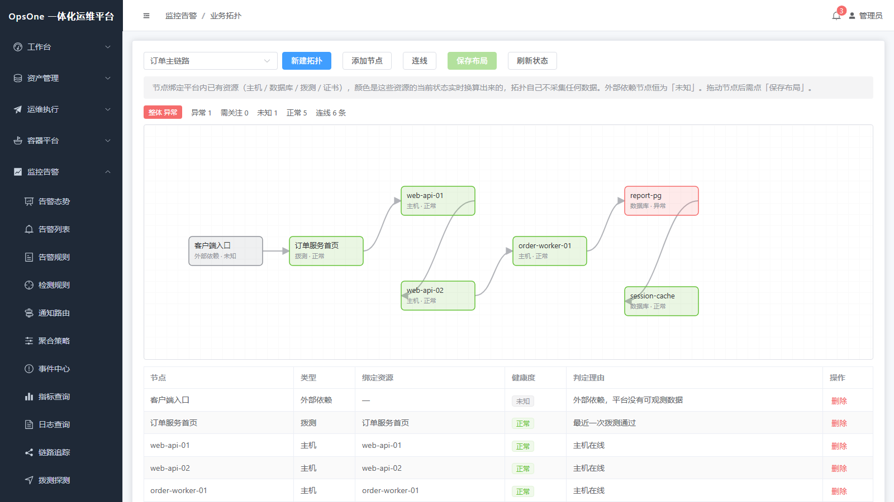

**AI 用量与成本**：网关流水按时间、模型、上游、调用人切开，成本按登记单价估算（明说是估值、不是供应商账单），平均耗时只算成功调用。

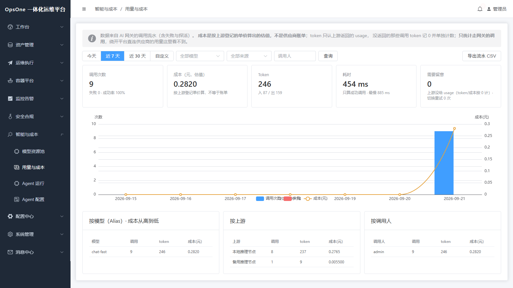

**数据库只读查询**：用资产里登记的账号浏览库表结构并跑只读 SQL，写操作与花招语句在下发前被拦、连接本身也是只读会话；结果标注实际下发的语句与截断情况，每次执行都进查询流水。

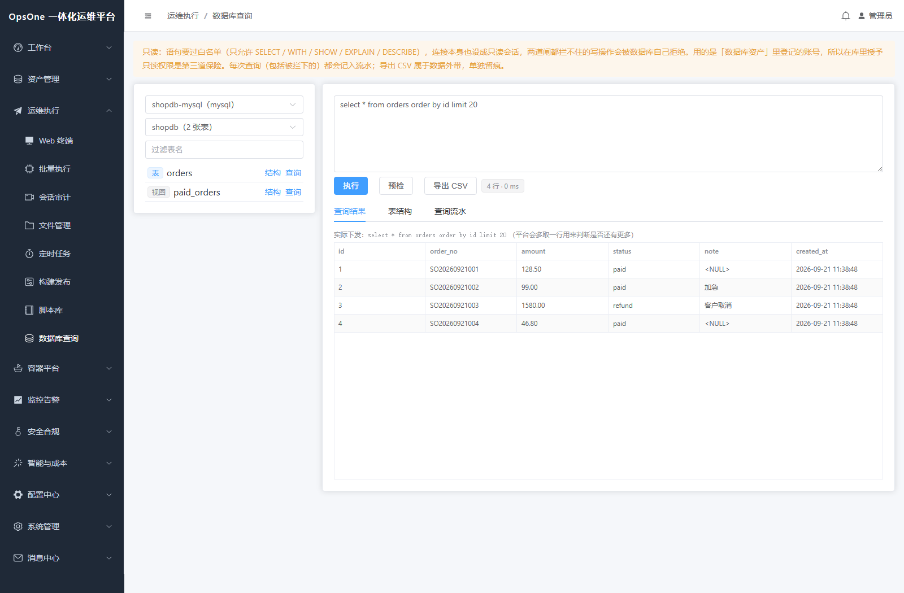

> 截图来自本地演示环境：主机是真实可 SSH 的 Linux（指标、批量执行、终端录像都是真跑的），容器页对接真实 k3s 集群，AI 网关接的是本机 OpenAI 兼容上游，数据库查询对接真实的 MariaDB / PostgreSQL。数据为演示内容，不是任何生产环境的脱敏数据。

## 已实现


- **主机资产**：CRUD、环境/标签/状态过滤、SSH 连通性探测并采集系统信息
- **数据库与固定资产**：数据库实例纳管（按类型给默认端口；MySQL/PG 的连通性检查会**真的建连接**并回写版本号，其余类型退化为 TCP 端口探测）；固定资产台账（SN/型号/位置/使用人、关联主机、采购与保修、到保提醒与原值合计）
- **盘点与采购**：盘点批次对资产做快照后逐条登记（正常/缺失/位置变更），完成时未盘按缺失处理；采购单带明细与自动汇总，收货可按明细生成固定资产
- **云账号台账**：云厂商 AK 集中登记（列表页脱敏展示）；不含资源同步

- **标签字典**：统一词表 + 分类配色 + 用量统计，主机与数据库表单里可选可新建

- **跳板机代理**：主机可关联跳板机，连接时先登录跳板机再在其隧道内握手到目标，终端与批量执行共用该链路，最多 3 层、成环即拒
- **Web 终端**：SSH PTY、窗口自适应、断线提示
- **会话录像与回放**：asciinema v2 格式落盘，网页端 xterm 回放，支持 1/2/4/8 倍速与按命令定位
- **会话审计检索**：会话列表按操作人 / 登录账号 / 主机 / 状态 / 风险 / 时间范围筛；另有一条**跨所有会话的命令检索**，回答「谁在哪台机器上敲过 `rm -rf`」——按命令关键字、风险（正常 / 高风险 / 已拦截）、操作人、登录账号、主机、时间范围组合查，结果直接带上是哪次会话、哪台机器、命中哪条规则，点一行就跳到那次会话的录像并定位到该命令的时间点，也可按当前条件导出 CSV（UTF-8 BOM，单次最多 10000 条）。命中规则的描述在记录命令时**快照**下来，之后规则改名或删掉，历史记录里写的仍是当时那条。风险筛选不只看会话上的拦截计数（会话异常中断时那个计数可能停在 0），同时看命令明细里的证据
- **命令审计与拦截**：服务端在输入流上还原命令行并按正则规则判定，命中拦截规则则不下发、清空当前行并告知操作人；内置 7 条高危规则，支持在线试跑
- **下发闸门**：批量执行、脚本下发、定时任务（含调度触发）四条路径都过同一道**服务端**闸门——命令按命令规则逐行匹配，命中拦截级规则一律不下发；目标含生产主机时必须显式确认，否则后端直接拒（不是只靠前端弹窗，直接调接口也绕不过）。定时任务的拦截级命令在**保存时**就拦掉，不用等到凌晨触发才失败；调度触发用的是保存任务时那次确认。被拦下来的下发不产生执行记录，所以单独进「下发拦截流水」：命令原文、命中规则、目标与生产台数、操作人、来源 IP 都在里面。下发前可以先「预检」，结果与真正下发用的是同一套判定

- **文件管理**：SFTP 目录浏览、上传、下载、新建目录、重命名、删除，全部动作留痕
- **定时任务**：cron 表达式编排批量命令、多主机并发下发、启停与立即执行、运行历史
- **主机批量导入导出**：CSV 模板下载 → 试运行看逐行报告（行号 + 新建/更新/跳过 + 原因）→ 正式导入；按 `address + port` 判定同一台机器，重复导入是幂等更新，secret 留空保持原凭据；导出**不含登录凭据**，只有台账字段
- **脚本库**：把常用运维命令收拢成可复用资产——分类、说明、`${PARAM}` 参数化（必填/默认值）、单机超时、风险等级；保存与下发前都用「命令规则」做静态预检，命中拦截级规则的脚本一律不允许下发，命中提醒级只提示；下发走批量执行同一条链路（同样的数据权限、并发上限、生产二次确认），并记录使用次数与最近使用人
- **批量执行**：并发下发（默认上限 10）、单机超时、生产环境二次确认、逐台输出留存
- **构建发布**：登记 Jenkins 服务器并测试连通性，按 job 路径参数化触发构建；构建号与结果需手动同步（平台不轮询，也不代管构建脚本）
- **数据库查询**：不再为了查一行数据去堡垒机上敲 `mysql -u`——直接拿「数据库资产」里登记的实例浏览库/表/字段/索引（带注释、行数估算、视图区分），并跑**只读 SQL**。三层防线：语句白名单（只放 SELECT/WITH/SHOW/EXPLAIN/DESCRIBE，拒多语句、拒注释绕过、拒 `INTO OUTFILE`/`FOR UPDATE`/`pg_read_file`/`COPY ... TO PROGRAM`/`sleep()` 这类花招）+ **会话级只读**（PG 用 `default_transaction_read_only`，MySQL 连上就 `SET SESSION TRANSACTION READ ONLY`）+ 你自己在库上给的只读授权。默认 500 行截断并明确标出「还有更多」，30 秒语句超时，结果可导出 CSV（UTF-8 BOM，上限 10000 行）；执行前可以先「预检」看会不会被拦。每一次执行——成功、被拦、报错、导出——都带语句原文、操作人、来源 IP、耗时、行数进「查询流水」，留存天数可配。**只做只读查询**：不支持写操作、结果集编辑、Redis/Mongo、BI 报表
- **告警接入**：按接入源签发独立推送地址，外部监控系统 POST JSON 即可；按「标题 + 标签」生成指纹去重，同指纹重复上报只累加次数
- **告警处理**：概览卡片、级别/状态/关键字筛选、确认与恢复、每条告警的通知投递流水
- **事件中心**：把一条或多条告警升格为「要有人跟进的事」——可从告警多选建单，也可在聚合预览里把整个桶建成一个事件；支持指派（给负责人发站内消息）、处置时间线、状态流转，标记已解决时可联动恢复关联告警；详情页给出诊断上下文（按告警标签反查主机/拨测/证书/规则的当前状态，对不上的标签原样列出）。平台不自动建单
- **聚合策略**：把同类告警按 接入源/级别/标题/任意标签 维度实时归桶，配合成桶阈值看清"哪一类在刷"；支持归桶预览与策略重叠检测。可选开启「抑制通知」——同一个桶在窗口内只通知首条，其余告警仍然入库、页面可见，并在告警上记录是哪条策略抑制的
- **静默与维护窗口**：发布或维护期间**只拦外发通知，不拦入库**——窗口内的告警照常出现在告警列表并标记「已静默」，事后能回答「为什么没收到通知」。条件按 级别 / 来源 / 标题关键字 / 标签 组合（填了的都要命中），保存前可以试算「这套条件现在会拦掉哪些告警」；不填条件必须显式勾选「匹配全部告警」，避免手滑全局静音。窗口到点自动失效不用手工解除，也支持提前结束；**值班升级按当下时间重新判定**，窗口里不叫人、窗口一过立刻恢复。已经拦过告警的窗口不允许删除（否则那些告警查不到原因），只能提前结束或停用
- **拨测探测**：HTTP（状态码 + 响应体关键字）与 TCP 拨测，连续失败达到设定次数才告警、恢复即关闭；记录每次结果并算可用率，历史保留天数由「数据留存」统一控制。所有拨测共用一个节奏（`OPS_PROBE_SPEC`，默认每 5 分钟）
- **容器平台**：粘贴 kubeconfig 纳管集群，调用 Kubernetes API（手写 REST，不引入 client-go）；集群列表给出版本、节点就绪数与最近检查结果，不可达或有节点 NotReady 自动写告警并走通知路由、恢复即关闭（`OPS_KUBE_CHECK_SPEC`，默认每 5 分钟）。工作负载页按命名空间看 Deployment / StatefulSet / DaemonSet 的副本就绪情况、Pod 状态与容器异常原因、以及集群事件（可只看 Warning）。只接受内嵌凭据的 kubeconfig
- **容器日志**：在 Pod 列表上直接看容器日志——多容器可切换（含 init 容器）、行数可选 200/500/2000/5000、可带时间戳、可看「上一个容器」的日志（排查 CrashLoopBackOff 就靠它）、可每 5 秒自动刷新、可下载成文件。单次最多取 1MB，超了如实标注「只显示前面部分」而不是静默截断。**不做 follow 流式跟随**（一次取一段，少一条长连接），也**不提供容器内执行命令（exec）**
- **集群资源改动**：看单个对象的 YAML（自动去掉 status 与 resourceVersion / uid / managedFields 这类集群自己维护的字段，改完可直接提交），走 Kubernetes **服务端 apply** 落盘，提交前可「预检」让 API Server 完整校验（含准入控制）但不落盘；Deployment / StatefulSet 还能直接改副本数，同样支持预检。字段被 kubectl 或别的控制器管着时会明确报冲突，确认后可勾「强制接管」。**只开放 Deployment / StatefulSet / DaemonSet / CronJob / Service / ConfigMap / Ingress，不提供删除、不开放 Secret / Namespace / RBAC** —— 要动这些仍然走 kubectl。写操作单独要 `kube:write` 权限，每次改动（含预检与失败）都留痕，记下对象、提交的 YAML 原文、API Server 的原话与操作人，保留天数纳入「数据留存」
- **集群服务转发**：把集群里的 Pod / Service 端口临时映射到平台上的一个端口，相当于把 `kubectl port-forward` 挪到平台来跑，不用给每个人发 kubeconfig。走 **API Server 的 WebSocket 通道**（不引 client-go、不自己实现 SPDY），每条进来的本地连接单独拨一条 WebSocket。转发 Service 时**每条连接重新解析后端 Pod**，Pod 重建或扩缩容之后隧道还能继续用（已验证）。隧道是进程内的活物，重启即消失，启动时会把残留记录标成「已关闭」而不是假装还活着；页面上实时给出活跃/累计连接数、双向流量、剩余时长与拨号失败原因。约束都由部署时的环境变量定死并在页面上写明：监听地址、端口区间、隧道条数、单条并发连接数、存活时长（到点自动关）。**隧道端口本身不做认证**，能连到它的人等同于能访问被转发的服务，详见 docs/SECURITY.md 第 16 节
- **平台健康**：一页看平台自己的状态——运行时长/协程/内存、调度器注册情况与内置巡检的最近运行、通知渠道与兜底路由是否可用、24h 投递失败、规则评估异常、告警积压、主机探测覆盖、数据库与录像目录占用；每项给出 正常/需关注/异常 与判定理由
- **业务拓扑**：把一条业务链路画成图，节点绑定平台里已有的主机 / 数据库 / 拨测 / 证书（或标为「外部依赖」），颜色直接由被绑资源的当前状态换算，并写明判定理由（「主机离线」「拨测连续失败 3 次」「证书剩 12 天」）；SVG 画布可拖动排布、布局批量保存，连线做了校验（禁自环、禁重复、两端必须同属一张拓扑），依赖成环给出闭合路径提示但不阻止。拓扑自己不采集数据、不产生告警
- **主机指标**：走已有的 SSH 通道采集 CPU / 内存 / 磁盘 / 负载 / 进程数 / 连接数 / 运行时长，**不装 agent、不依赖 Prometheus**；远端只跑一条只读命令（读 `/proc` 与 `df`），百分比换算都在平台侧做。磁盘只统计真实块设备并排除 snap 的 squashfs 与只读镜像挂载，否则「100% 占用」会天天误报。采集失败也落库并单独告警，超过 30 分钟没采到的样本标为过期且不参与告警判定。默认每 5 分钟采集（`OPS_HOST_METRIC_SPEC` 可改或关闭），列表带趋势图，保留天数纳入「数据留存」
- **链路追踪**：接入已有的 Jaeger，按服务/操作/最小耗时/时间范围搜 trace，列表直接给出入口服务与操作、总耗时、span 数、涉及的服务、**出错 span 数**；点进去是 span 瀑布图（按父子关系深度优先排列、相对偏移与耗时按整条链路跨度换算），点某个 span 看它的全部标签。日志里看到 trace_id 可以直接粘进去查。出错判定同时认 OpenTracing 的 `error=true`、HTTP 5xx 与 OTel 的 `otel.status_code=ERROR`。**平台不接收上报、不存链路数据**，也不做服务依赖拓扑图（Jaeger 自己有）
- **日志查询**：接入已有的 Loki，在平台里写 LogQL 查日志行——标签下拉可直接拼出选择器（`{app="web"}`）、时间范围与条数可选（最多 5000 条）、支持最新在前/最旧在前、单行过长自动截断并标记、可下载为文件。跨流结果会按时间归并成一条时间线（Loki 只保证每个流内有序），并显示 Loki 扫了多少行/多少字节。支持多租户（`X-Scope-OrgID`）与鉴权头。**平台不存日志、不改写 LogQL**：报错原样来自 Loki（它的报错常是纯文本，也照实带出）；聚合类表达式返回的是指标，会明确提示去「指标查询」页。**不做实时 tail**
- **指标查询**：接入已有的 Prometheus（或兼容实现），在平台里直接跑 PromQL——即时查询看当前值（表格），范围查询看趋势（折线图，步长按时间范围自动算、点数上限 11000 与 Prometheus 对齐）。支持多数据源与默认源、连通性检查（读 buildinfo 与 tsdb 状态，顺带显示版本与序列数）、指标名补全、常用查询收藏。**平台不存时序数据、不改写 PromQL**：语法报错原样来自 Prometheus（带 errorType 与列号），返回的警告也照实透出；曲线超过 60 条会截断并提示把查询收窄
- **暴露面监测**：登记每台对外机器「该开哪些端口」，平台从自己所在网络位置定时做 TCP 连接核对——开着但没登记的端口写告警并走通知路由，登记齐全后自动恢复；首次纳管可一键把当前开放端口「登记为基线」。也会记「登记了却没开」（服务可能挂了）但不为此告警。端口清单支持 `22,80,443,8000-8010` 混写，单目标一次最多 1024 个端口；只做连接探测，**不发探针载荷、不识别服务指纹、不做全端口扫描**。默认每天 04:20 扫一次（`OPS_EXPOSURE_SPEC` 可改或关闭），每次扫描落一条历史，保留天数纳入「数据留存」
- **模型资源池**：把多个供应商的模型收在平台后面做成一个网关——调用方只认平台给的 Alias，平台按权重挑一条上游转发（`POST /api/v1/ai/chat/completions`，参数与 OpenAI 的 chat 接口一致），失败自动换下一条，换供应商或加降级备份都不用动调用方代码。每次调用（含失败与自动切换）都落一条流水，token 取上游返回的 usage，成本按每个上游登记的单价（元/千 token）算。「检查」不只拉 `/models`，还会真打一次 `max_tokens=1` 的最小调用——**有些实现的 `/models` 不校验密钥**（llama.cpp server 实测如此），只探列表会得出「可用」的假结论。**只支持 OpenAI 兼容的非流式 chat**（流式拿不到完整 usage，用量就成了估算）；**提示词与回复正文一律不落库**（那是业务数据）；**成本是按登记单价算的估值，不等于供应商账单**，平台不做对账
- **用量与成本**：把网关的调用流水按时间、模型、上游、调用人切开——快捷区间（今天按小时 / 近 7 天 / 近 30 天 / 自定义）、调用次数与成本的趋势图（没人调用的那天补成 0 而不是把折线直接连过去）、三张排名表（按 Alias / 上游 / 调用人，按成本从高到低），以及可按当前条件导出的流水 CSV（UTF-8 BOM，单次最多 10000 条，只有元数据、没有正文）。平均耗时只算成功调用（失败的多是连接失败的 0，混进去会把均值拉垮）。分桶在服务端用 Go 做而不是写 SQL 的日期函数，避免时区把跨天的账算串。流水的保留天数纳入「数据留存」（默认 365 天，删了那段时间的账就算不出来了）
- **Agent（只读分析器）**：把平台自己的数据喂给模型换一段结论——上下文可取「最近未恢复告警（可按级别）/ 某台主机最近的采样 / 某个执行作业的逐台结果（失败的排前面）/ 某次会话敲过的命令（带风险与命中规则）」，提示词用 `text/template` 写（`{{.context}}` 放数据、`{{.input}}` 放运行时补充），保存时就校验模板语法、Alias 是否真有可用上游、以及「取了数据却没在模板里用 context」这种一定跑不出效果的配置。**它只读、不执行任何命令、不改任何东西**，结论仅供人参考。每次运行记一条：喂了多少条/多少字符（撞上限会标「已截断」）、模型结论正文、token、成本、耗时；上下文取不到（主机不存在、作业没结果）时**先落一条失败记录再报错，且不会去调模型**。Agent 的调用与网关共用同一条派发路径，因此一并计入「用量与成本」（来源标 `agent`）。运行记录的保留天数同样纳入「数据留存」
- **告警规则**：基于平台自身数据的规则引擎（主机 CPU/内存/磁盘/单核负载最高值与采集失败、主机探测离线/失联、证书到期与巡检失败、批量执行与定时任务失败、构建失败、告警积压、通知投递失败），支持比较符 + 阈值 + 统计窗口 + 连续命中次数降噪；默认每 5 分钟评估（`OPS_ALERT_RULE_SPEC` 可改或关闭），命中写告警并走通知路由，条件不再满足自动恢复，规则可「试跑」立即评估
- **IM 组织同步**：用企业自建应用的凭据（与「通知渠道」里的群机器人是两套东西）把企业微信 / 钉钉 / 飞书的部门树与成员同步进平台——部门按 `provider:部门ID` 记在部门 Code 上、挂到指定公司下；成员先按绑定关系找人，找不到再按同名账号建立绑定，都没有才新建（随机口令 + 只在新建时给默认角色）。同步遵循**只补不毁**：部门只新建与改名、**从不删除**；用户**从不删除**，IM 侧查不到的人改为停用（可关，内置 admin 永不停用）；**已有用户的角色与口令一律不动**，否则手工调过的权限会被下一次同步抹平。预演与执行走同一段逻辑，预演**一行都不写库**、并同样留一条记录。三家的错误都藏在 HTTP 200 里（企微/钉钉是 `errcode`、飞书是 `code`），适配器一律先看错误码再看状态码。接口地址可覆盖（走私有代理或对着假上游验证）。**这些接口的路径与字段名来自公开文档，没有在真实企业租户上验过**（见 docs/SECURITY.md 23）
- **IM 扫码登录**：同步进来的人可以直接用企业微信 / 钉钉 / 飞书扫码进平台，不用再记一套口令。按应用单独开关，登录页只列开了开关的入口；点进去跳各家授权页，回调时用 code 换 IM 身份（企微 `getuserinfo` 拿 userid；钉钉换到的是 unionId，要再用 `/topapi/user/getbyunionid` 反查成 userid 才对得上通讯录；飞书用 open_id），再按绑定表找平台账号。**必须先绑定才放进来**：IM 里有、平台没绑过的人一律拒（不自动建号——那等于把「谁能进平台」的决定权交给通讯录），账号停用的也拒。回调**不把 JWT 放进 URL**，只带一个一次性 ticket（2 分钟内有效、用过即废），前端拿 ticket 再换令牌，换的时候重新查一遍账号状态；发起时的 `state` 同样一次性（5 分钟），回调重放会被拒。ticket / state 存在内存里，**重启会让进行中的扫码失效，多实例部署必须换成共享存储**（见 docs/SECURITY.md 24）
- **检测规则**：判定「多条告警的组合」——并发窗（同一窗口内都出现）、顺序链（必须按先后发生）、窗口 Join（还要落在同一个对象上，比如同一台主机）；每步按标题/摘要关键字 + 接入源 + 级别 + 标签匹配告警，窗口内**发生过**的告警都算（含已恢复的），命中写告警并走通知路由、条件不再满足自动恢复。默认每 5 分钟评估（`OPS_DETECTION_SPEC` 可改或关闭），建规则时可「预演」看每步各命中哪些告警。检测不吃自己的输出，避免规则被自身告警顶住不恢复
- **告警值班与升级**：排班表按小时/天/周在成员之间轮换（交接时刻由基准时间的时分决定），可按级别只接管一部分告警；代班在时间段内顶替当班人。告警「firing 且未确认」超过设定分钟数就升一级，最多升到设定级数，每一级叫对应位次的人——站内消息一定发，勾了「发邮件」再按用户邮箱补发一封，每次叫人都落一条升级记录（没填邮箱就记 `failed` 而不是静默跳过）。同一告警同一级只叫一次；只扫最近 24 小时且不早于排班表创建时间的告警，避免新建表就把历史积压全叫一遍。默认每分钟扫描（`OPS_ONCALL_SPEC` 可改或关闭），可「试跑」立即扫一遍并看结果。**不支持短信/电话**（账号体系里没有手机号），也不做换班审批
- **通知路由与渠道**：按优先级 + 级别 + 标签匹配选路，支持兜底路由与选路预演；渠道分 webhook（HTTP POST 固定 JSON，可带鉴权头）、**群机器人**（企业微信 / 钉钉 / 飞书，按各家报文发纯文本，支持 @ 成员与 @所有人，钉钉加签与飞书签名校验都做了）、email（SMTP + 邮件模板）与 silent（只留记录）。群机器人**不看 HTTP 状态码定成败**：被移出群、超频、签名过期都会返回 200 加一个非零 errcode，平台按 errcode 判定并把厂商原话写进投递记录
- **双因子口令**：平台账号可绑定标准 TOTP（SHA1/6 位/30 秒，任意验证器），登录时口令 + 动态验证码两步校验，同一验证码在有效期内不可重复使用；策略可设为强制，未绑定账号除个人页与绑定接口外一律被后端拒绝；解绑需口令 + 验证码，忘带手机由管理员重置（无恢复码）
- **LDAP / AD 账号接入**：用公司域账号口令登录平台，不用再维护一套口令。登记目录服务器（明文 / LDAPS / StartTLS，内网自签证书可显式跳过校验）后可**测试连接**（真建连、真用服务账号 bind、真在 Base DN 下数人）、**搜索目录里的人**并绑定到平台账号，还有一个**试登录诊断**：用真实口令走一遍，把「过滤器没命中 / 目录拒绝口令 / 目录认了但平台没账号 / 没绑定 / 开关是关的」逐步列出来——登录页那句「用户名或密码错误」查不出这些。两条硬规则：**绑定即托管**，账号一旦绑定，本地口令立即失效（否则域账号停用后平台里那份旧口令就是后门）；**绝不按目录自动建号**，目录里有、平台没有的人一律拒（与 IM 扫码登录同一原则）。可选「首登自动绑定」：平台已有同名账号时首次用域口令登录即绑定，账号不存在仍然拒绝。域账号同样要过双因子；平台只读目录，不写回、不做组织同步、**不做组到角色映射**（那等于把「谁是管理员」交给目录管理员）
- **API 令牌（服务账号）**：给 CI、脚本、外部系统一条正经的调用凭据，不用把某个人的账号口令写进流水线配置。令牌明文**只在创建与轮换时出现一次**（库里只存 SHA-256，丢了只能轮换）；**默认只读**（只放 GET），要写必须显式关掉只读并授予权限码；令牌权限 = 授予的权限码 **∩ 归属人当下的权限**，归属人被降权或停用，令牌立即跟着失效；可设来源 IP 白名单（支持 CIDR）、有效期、随时撤销或轮换（旧明文立刻作废）。令牌**不能用于 Web 终端与端口转发**（只认请求头、拒绝 WebSocket 升级——那条链路必须是人，会话审计才有意义），也**不受强制双因子约束**（它不是人，约束在只读 / 交集 / 可撤销上）。每次写操作在审计里同时记下令牌名与归属人，被 403 拒掉的调用一样留痕；`GET /api/v1/me/whoami` 让调用方自己确认「我是谁、生效权限有哪些、是不是只读」


- **证书管理**：登记域名/端口后探测对端 TLS 证书，记录颁发者、SAN、有效期、SHA256 指纹与根证书链校验结果；到期阈值可按证书设置，命中「即将到期 / 已过期 / 巡检失败」自动写入告警并走通知路由，换证后自动恢复。默认每天 08:00 巡检（`OPS_CERT_CHECK_SPEC` 可改或关闭），不签发、不托管私钥、不做自动续签
- **菜单管理**：内置菜单可改标题/图标/排序/隐藏（不被启动覆盖），自建菜单可完全自定义
- **站点导航与邮件模板**：内部系统入口卡片墙；邮件模板用 Go template 语法，带语法校验与样例预览

- **告警态势**：24h/7d/30d 趋势折线、级别与来源分布、Top 标签、平均确认与恢复时长
- **公告与站内消息**：公告草稿/发布/下线，发布即向全员投递站内消息（下线撤回未读）；严重告警自动推送给持有处理权限的用户，顶栏铃铛显示未读角标

- **RBAC**：用户 / 角色 / 菜单三级授权，菜单与按钮两级权限，后端逐接口校验
- **组织与数据权限**：公司 + 多级部门树；角色级数据范围（全部 / 本部门 / 本部门及下级 / 仅本人 / 指定部门），多角色取并集，作用于主机列表、探测、终端、文件管理、批量执行与定时任务，配有生效诊断
- **资源授权**：数据范围之外按用户/角色把指定主机或数据库额外授予，可限定动作（终端 / 文件 / 执行 / 管理）与有效期；与菜单权限是 AND 关系，两层都过才放行


- **操作审计**：写操作记录操作人、接口、路由模板、状态码、来源 IP、耗时；按操作人 / 方法 / 接口关键字 / 成功失败 / 来源 IP / 时间范围组合检索，关键字同时匹配实际路径与路由模板（搜 `/hosts/3` 就是这台主机身上发生过的事），结果里直接给出失败条数可一键只看失败；按当前检索条件导出 CSV（UTF-8 BOM，单次最多 10000 条）
- **个人工作台**：待办汇总、我的资源（按数据范围过滤的主机统计与分布）、我的操作流水 / 会话 / 执行记录
- **平台配置**：分组键值配置，带类型校验；平台名称与登录提示支持白标（改配置即生效，无需改代码），批量执行并发、上传上限、录像保留天数均由配置驱动
- **数据留存**：执行记录、拨测记录、通知投递、操作审计、会话流水、已恢复告警六类数据各自配置保留天数（0 表示永久），先「试算」看每类会删多少行、哪些是连带删除（逐台执行结果、命令明细与录像文件）、哪些删后无法追溯，确认无误再执行；默认每天 03:30 自动清理（`OPS_RETENTION_SPEC` 可改或关闭），清理动作写审计，平台健康页同步展示可清理行数


其余模块（容器平台、监控告警、安全合规、配置中心等）菜单与权限位已就位，实现状态见 [docs/ROADMAP.md](docs/ROADMAP.md)。

## 快速开始

需要 Go 1.25+、Node 20+、pnpm。

```bash
# 后端，默认监听 :8080，首次启动自动建表并创建 admin
cd server
export OPS_JWT_SECRET="$(openssl rand -hex 32)"
go run ./cmd/server

# 前端，默认 http://127.0.0.1:5173
cd web
pnpm install
pnpm dev
```

初始账号 `admin`，初始口令取自 `OPS_ADMIN_PASSWORD`（默认 `Admin@123456`），**首次登录后立即修改**。

Windows PowerShell 下设置环境变量用 `$env:OPS_JWT_SECRET="..."`。

## 部署

生产部署看 **[docs/DEPLOY.md](docs/DEPLOY.md)**（二进制 + systemd / Docker Compose、反代与 TLS、备份恢复、升级、排障）。要点：

- `make dist` 打出一个包：静态二进制 + 前端产物 + 部署样例。配上 `OPS_WEB_DIR` 后**后端直接托管前端**，单进程就能交付，不需要另配 nginx
- `OPS_ENV=prod` 下**不安全的配置会让进程拒绝启动**（默认 JWT 密钥、默认 admin 口令、空/含 localhost 的 CORS 白名单、开着的 DEBUG），而不是打一行 warn 就放行
- 探活分两个：`/healthz` 只看进程，`/readyz` 真查数据库（负载均衡与容器探针该用后者）
- SIGTERM 会走**优雅退出**：停调度 → 通知并断开 Web 终端 → 关闭转发隧道并落库 → 等在跑的请求收尾 → 收尾会话状态
- 自带**备份与恢复**：`ops backup` / `ops restore`（SQLite `VACUUM INTO` 快照 + 录像 tar.gz），默认每天 03:00 自动备份并早于数据留存清理
- 交付物：`Dockerfile`、`docker-compose.yml`、`deploy/opsone.service`、`deploy/nginx.conf.example`、`deploy/opsone.env.example`、`Makefile`

## 配置项

全部通过环境变量注入：

- `OPS_ENV` — 运行模式 `dev`（默认）或 `prod`；prod 下安全底线不达标直接拒绝启动，见 docs/DEPLOY.md 第 5 节
- `OPS_ADDR` — 监听地址，默认 `:8080`
- `OPS_DSN` — SQLite 文件路径，默认 `ops.db`；换 MySQL/PostgreSQL 需要改 `server/internal/db/db.go` 的 driver 并处理方言差异（**不是改个配置就行**）
- `OPS_WEB_DIR` — 前端构建产物目录，配了就由后端托管前端并做 SPA 回落；留空则只有 API
- `OPS_JWT_SECRET` — 令牌签名密钥，**生产必填**（≥32 字节）；dev 下未设置会用开发默认值并告警
- `OPS_TOKEN_TTL_HOUR` — 令牌有效期，默认 12
- `OPS_ALLOW_ORIGINS` — CORS 与 WebSocket Origin 白名单，逗号分隔，默认 `http://localhost:5173`
- `OPS_TRUSTED_PROXIES` — 可信反代的 IP/CIDR，逗号分隔。**默认为空即谁都不信**，`X-Forwarded-For` 一律忽略（否则审计里的来源 IP 可被伪造）；部署在 nginx 后要填 nginx 地址
- `OPS_ADMIN_PASSWORD` — 内置管理员初始口令，默认 `Admin@123456`
- `OPS_RECORD_DIR` — 会话录像目录，默认 `recordings`
- `OPS_SHUTDOWN_TIMEOUT_SEC` — 优雅退出等待上限，默认 30；批量执行是同步请求，给小了会把作业截断
- `OPS_SSH_STRICT_HOST_KEY` — 是否校验 SSH 主机指纹，默认 `false`；置 `true` 后首次连接记录指纹（TOFU），之后指纹变化即拒绝
- `OPS_BACKUP_SPEC` / `OPS_BACKUP_DIR` / `OPS_BACKUP_KEEP` — 自动备份的节奏、落盘目录与保留份数，默认 `0 3 * * *` / `backups` / `7`；节奏刻意早于数据留存清理
- `OPS_CERT_CHECK_SPEC` — 证书巡检的 cron 表达式（标准五段），默认 `0 8 * * *`；置空则不做定时巡检，只能在界面上手动触发
- `OPS_ALERT_RULE_SPEC` — 告警规则评估的 cron 表达式，默认 `*/5 * * * *`；置空则只能在界面上手动试跑
- `OPS_PROBE_SPEC` — 拨测执行的 cron 表达式，默认 `*/5 * * * *`；置空则只能手动拨测。所有拨测共用这一个节奏
- `OPS_RETENTION_SPEC` — 数据留存清理的 cron 表达式，默认 `30 3 * * *`；置空则只能在界面上手动试算与清理
- `OPS_DETECTION_SPEC` — 检测规则评估的 cron 表达式，默认 `*/5 * * * *`；置空则只能在界面上手动试跑
- `OPS_KUBE_CHECK_SPEC` — 容器集群连通性检查的 cron 表达式，默认 `*/5 * * * *`；置空则只能在界面上手动检查
- `OPS_HOST_METRIC_SPEC` — 主机指标采集的 cron 表达式，默认 `*/5 * * * *`；置空则只能手动采集。采集走 SSH，节奏太密会给主机和平台都加压
- `OPS_ONCALL_SPEC` — 值班升级扫描的 cron 表达式，默认 `* * * * *`；置空则只能在界面上手动试跑。扫描只读本地库，每分钟跑不算负担，但比「未确认超时分钟数」更密没有意义
- `OPS_EXPOSURE_SPEC` — 暴露面扫描的 cron 表达式，默认 `20 4 * * *`；置空则只能手动扫描。扫描会对目标发起大量 TCP 连接，别配得太密

集群服务转发（隧道端口不做认证，这几个值就是它的全部约束）：

- `OPS_FORWARD_BIND` — 隧道监听地址，默认 `0.0.0.0`；只给平台本机用就设 `127.0.0.1`
- `OPS_FORWARD_PORT_MIN` / `OPS_FORWARD_PORT_MAX` — 可占用的端口区间，默认 `30000` / `30099`
- `OPS_FORWARD_MAX` — 同时存在的隧道条数上限，默认 `8`
- `OPS_FORWARD_TTL_MINUTES` — 隧道存活时长上限（分钟），到点自动关闭，默认 `120`
- `OPS_FORWARD_CONN_MAX` — 单条隧道的并发连接上限，默认 `32`；每条连接都要向 API Server 单开一条 WebSocket


- `OPS_DEBUG` — `true` 时输出 SQL 日志并启用 gin 调试模式；`dev` 默认开、`prod` 默认关（prod 下显式打开会被拒绝启动）

数字与布尔类型的变量写错（例如 `OPS_TOKEN_TTL_HOUR=twelve`）会直接报错退出，不会静默回退默认值。

运行期参数（平台名称、登录提示、批量执行并发、上传上限、录像保留天数、双因子策略）在「系统管理 → 系统配置」里改，改完即生效，不需要重启。


## 目录结构

```
server/
  cmd/server/          入口与路由注册
  internal/bastion/    会话录像、命令审计
  internal/config/     环境变量配置
  internal/db/         迁移与种子数据（菜单、角色、内置规则）
  internal/handler/    HTTP 处理器
  internal/middleware/ 认证、权限、审计
  internal/model/      数据模型
  internal/scheduler/  定时任务调度
  internal/sshx/       SSH 连接、跳板链、命令执行
web/
  src/api/             接口定义与 axios 封装
  src/layouts/         主框架
  src/router/          静态路由 + 后端菜单动态注册
  src/stores/          用户与权限状态
  src/views/           业务页面
docs/
  DEPLOY.md            部署与运维手册（交付、备份恢复、升级、排障）
  ROADMAP.md           模块清单与实现状态
  SECURITY.md          安全设计与已知风险
deploy/
  opsone.service       systemd unit
  opsone.env.example   配置样例
  nginx.conf.example   反代样例（WebSocket 与超时都写清楚了）
Dockerfile / docker-compose.yml / Makefile
```

## 菜单与权限

菜单树当前由种子数据统一维护（`server/internal/db/db.go` 的 `Seed`），按 ID 分段：10 工作台 / 100 资产 / 200 运维执行 / 300 容器 / 400 监控告警 / 500 安全合规 / 600 智能与成本 / 700 配置中心 / 800 系统管理 / 900 消息中心。种子数据是权威来源，启动时全量覆盖并清理不在清单内的历史菜单。

新增页面：在 `web/src/views` 下建 `xxx/index.vue`，再往种子数据里加一条菜单，`Component` 填 `/xxx/index` 即可；前端按后端下发的菜单动态注册路由。按钮级权限用 `v-perm="'host:create'"`，后端对应接口挂 `middleware.RequirePerm`。

## 安全须知

部署前务必阅读 [docs/SECURITY.md](docs/SECURITY.md)。当前有几处明确的取舍需要知晓：

- 主机登录凭据**明文存储**在数据库，数据库文件与备份等同于凭据本体
- SSH 主机指纹默认不校验，存在中间人风险，可用 `OPS_SSH_STRICT_HOST_KEY=true` 开启
- 命令拦截是 PTY 层面的启发式手段，能挡常见误操作，但拦不住 `vim :!cmd`、base64 解码执行等绕过，不能当作强制访问控制
- 会话录像包含终端输出全文，可能含配置与令牌，需按敏感数据管理

## License

[MIT](LICENSE)
